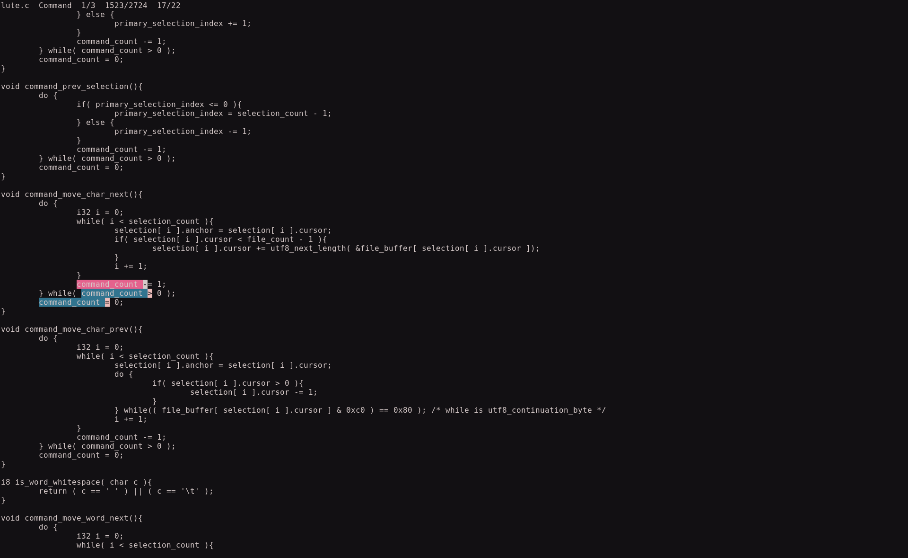

## Lute

**Lu**ddite **T**ext **E**ditor

*Lute is in early developement, expect bugs*

This file has information about using Lute.
For information about configuring Lute, see config.h.
For information about the source code, see lute.c.

Lute is a tui text editor built arround a modal multiple selection model with a vim-like but sane default keymap.
Lute is inspired by vim and kakoune, thoes who have worked with them or another modal editor (neovim, helix) will find may concepts in lute familiar.
Lute's source code configuration design is inspired by suckless.org software.

What makes lute special:
- Build from the ground up for user customization via config.h and patches.
- Provides user feedback on every keystroke.
- Edit with multiple selections.
- The primary selection is always centered.

### Compiling / Installing

Lute currently only supports Linux, I will start working on Windows support soon.
I dont have a Mac to test Lute with.
If you are having issues compiling Lute on *any* os, please open an issue.

Before compiling, see 'makefile' and change 'COMPILER' and 'DESTINATION' to fit your system.
The default compiler is 'gcc' and the default destination is '/usr/local/bin'.

To compile: `make build`

To install: `sudo make install`

To uninstall: `sudo make uninstall`

To remove all compiled files: `make clean`

### keybind.c

Reads the user input and returns the string needed for a keybind.

To compile: `make keybind`

### Default Keymap

For More Information see config.h and lute.c.

[*] Lowercase moves the selection, Uppercase appends to the selection.
[^] Lowercase acts on the selection, Uppercase acts on the selection's cursor's line.

+---------+---------+---------+---------+---------+---------+---------+---------+---------+---------+---------+---------+---------+-------------+
|         |         |         |         |         |         |         |         |         |Inside ()|Inside ()|         |         |             |
|         |         |         |         |         |         |         |         |         |         |         |         |         |             |
|         |1        |2        |3        |4        |5        |6        |7        |8        |9        |0        |         |         |             |
+---------+---+-----+---+-----+---+-----+---+-----+---+-----+---+-----+---+-----+---+-----+---+-----+---+-----+---+-----+---+-----+---+---------+
|             |Quit     |         |         |         |SelFileSt|         |Redo     |         |         |         |Inside {}|Inside {}|         |
|             |         |         |*WordNext|^Replace |         |^Yank    |         |         |         |         |         |         |         |
|             |WriteQuit|WriteFile|         |         |SelFileEn|         |Undo     |Insert   |Newline  |Paste    |Inside []|Inside []|         |
+-------------+--+------+--+------+--+------+--+------+--+------+--+------+--+------+--+------+--+------+--+------+--+------+--+------+---------+
|                |SelFileAl|SplitNewl|         |         |Goto End |         |         |         |         |SelMatchA|Inside ""|                |
|                |         |         |^Delete  |*FindNext|         |*CharPrev|*LineDown|*Line Up |*CharNext|         |         |                |
|                |SwapAn/Cu|SplitSear|         |         |Goto     |         |         |         |         |SelCollap|Inside ''|                |
+----------------+---+-----+---+-----+---+-----+---+-----+---+-----+---+-----+---+-----+---+-----+---+-----+---+-----+---+----------------------+
|                    |         |         |         |         |         |         |         |Indnet   |Deindent |SelMatchP|                      |
|                    |*LineStar|*Line End|^Change  |*FindPrev|*WordPrev|*ParaDown|*Para Up |         |         |         |                      |
|                    |         |         |         |         |         |         |         |Sel Next |Sel Prev |SelMatchN|                      |
+----------+---------+---------+---------+---------+---------+---------+---------+---------+---------+---------+-+-------+-+---------+----------+
|          |         |         |         |                                                 |         |           |         |         |          |
|          |         |         |         |                                                 |         |           |         |         |          |
|          |         |         |         |                                                 |         |           |         |         |          |
+----------+---------+---------+---------+-------------------------------------------------+---------+-----------+---------+---------+----------+

